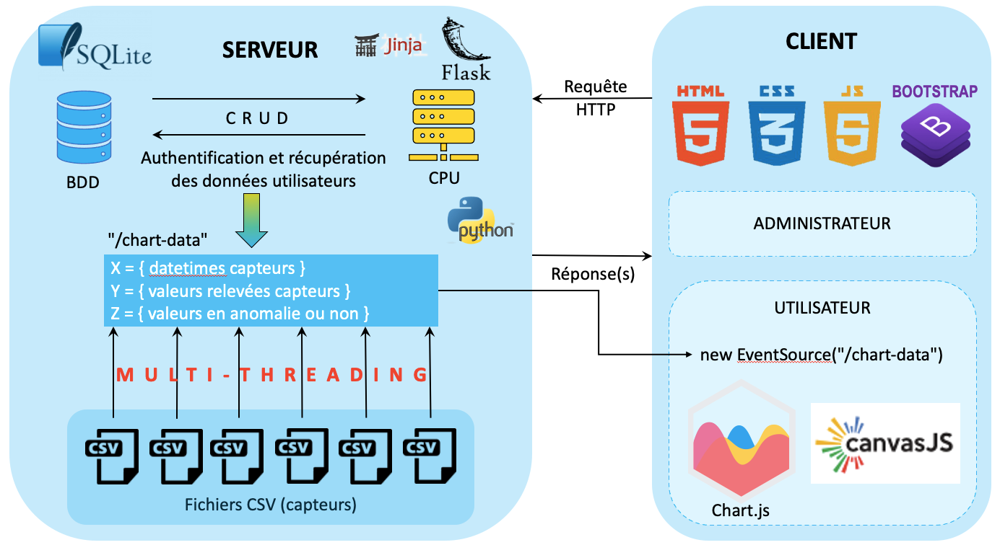

# SSEPythonFlask_MonitIntel
Présentation du projet
----------------------
* Objectif du projet est la surveillance (monitoring) des données IIoT(IoT industrielle) avec des problématiques de tableaux de bord temps réel. 
* 

Installation
------------
* Installer les packages ```$ pip install -r requirements.txt```
* Initialiser le mot de passe de l'admin et la base de données ```python init_db.py```

Pour lancer :
------
* ```$ FLASK_APP=app.py FLASK_ENV=development flask run```
* Allez sur localhost http://127.0.0.1:5000/ depuis votre navigateur. 
